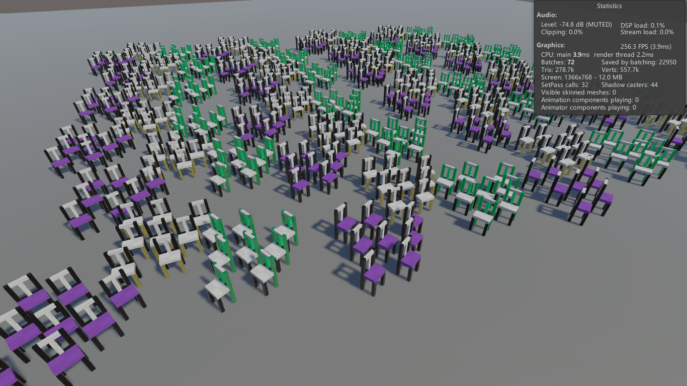

# Draw Instanced System (SRP)

`Graphics.DrawMeshInstancedProcedural` 的包装器，旨在使用实例化绘制时减少提交数据给 GPU 的频率。

此版本适配 URP，内部的绘制方法适应新版本引擎替换为 `Graphics.RenderMeshPrimitives`，绘制效率一致。

__[2025-08-27]__：增加 Shader Graph 实现的实例化材质，现在可通过 Shader Graph 着色器兼容 HDRP。

测试用例绘制的物体约 72M 个顶点，提交 2500 个调用批次，帧时间约 12ms

## 工作流程

将 `绘制实例调度器`（`Com.Rendering.InstancedMeshRenderDispatcher`）挂在空节点上并保存为预制体，每个调度器保存一对材质球和网格作为绘制实例的依据，以名称索引。运行期通过名称查找绘制特定种类实例。

绘制实例调度器不会自动加载，需要在初始化阶段主动实例化。

要绘制实例的物体上挂载 `绘制实例符号`（`Com.Rendering.InstancedMeshRenderToken`），这里建议也做成预制体。绘制实例符号保存定向到的调度器、每批次实例的颜色、包围盒（本地空间）和每实例偏移量等信息。需要在业务逻辑脚本中引用这个组件详细设置。

任何绘制实例符号被实例化之前需要保证其索引的调度器已经被正确加载。

## 内存

核心组件使用 `Job System` 完成计算工作，这会占据非托管内存，运行期可以在合适的时机调用 `InstancedMeshRenderDispatcher.TrimExcess()` 释放多余的非托管内存。

内部调度器会在内容无变化（没有增删对象）后的一段时间内尝试让出内存（预设周期 150s）。

## 着色器

包内建的着色器基于 URP 的光照着色器（`UniversalRenderPipeline/Lit`）修改，将其 `GPU Instancing` 的部分修改为适配 `DrawMeshInstancedProcedural` 的形式，并添加缓冲区：

- `_BaseColors`：`StructuredBuffer<half4>`，rgba 颜色缓冲区，在片元着色器按实例化索引 `unity_InstanceID` 读取颜色。
- `_LocalToWorldBuffer`：`StructuredBuffer<float4x4>`，世界空间变换矩阵缓冲区，按实例化索引 `unity_InstanceID` 读取缓冲区内容为每个实例写入 `UNITY_MATRIX_M`。
- `_WorldToLocalBuffer`：`StructuredBuffer<float4x4>`，世界空间变换逆矩阵缓冲区，按实例化索引 `unity_InstanceID` 读取缓冲区内容为每个实例写入 `UNITY_MATRIX_I_M`。

使用这些缓冲区且兼容 URP 的着色器可以在此体系下正常工作。

